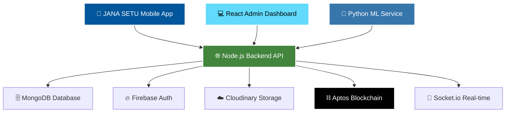

# 🏛️ JANA SETU
**Civic Issue Resolution Platform**  
Node.js React Flutter MongoDB Socket.io Express.js Vite Aptos Python

A comprehensive civic engagement platform with AI-powered issue reporting, real-time analytics, blockchain transparency, and government-citizen collaboration.

## 📋 Table of Contents
- [🎯 Overview](#-overview)
- [✨ Key Features](#-key-features)
- [🏗️ System Architecture](#️-system-architecture)
- [🔄 Workflow Diagrams](#-workflow-diagrams)
- [🚀 Quick Start](#-quick-start)
- [📁 Project Structure](#-project-structure)
- [🛠️ Technology Stack](#️-technology-stack)
- [👥 User Roles & Features](#-user-roles--features)
- [🔧 API Endpoints](#-api-endpoints)
- [📊 Database Models](#-database-models)
- [🎨 Frontend Architecture](#-frontend-architecture)
- [📱 Real-time Features](#-real-time-features)
- [🔐 Security & Authentication](#-security--authentication)
- [🚀 Deployment Guide](#-deployment-guide)

## 🎯 Overview
**JANA SETU** (*"Bridge to People"* in Sanskrit) is a modern, full-stack civic engagement platform that revolutionizes how citizens report issues and interact with local governments. The platform combines AI-powered classification, real-time tracking, blockchain transparency, and comprehensive analytics to create an efficient civic ecosystem.

### 🌟 Core Objectives
- 📱 **Smart Reporting**: AI-powered issue classification and routing
- 🎥 **Real-time Collaboration**: Live updates and community engagement
- 🗺️ **Geographic Intelligence**: Location-based analytics and mapping
- ⭐ **Transparency**: Blockchain-verified accountability system
- 🛡️ **Quality Assurance**: ML-driven content moderation and validation

## ✨ Key Features

### 👨‍💼 Citizen Features
- 🔐 **Secure Authentication** with JWT tokens and Firebase integration
- 📱 **Smart Issue Reporting** with photo, voice, and GPS capture
- 🤖 **AI Classification** with 85%+ accuracy in department routing
- 📍 **Precision Location** tracking with address resolution
- 🔔 **Real-time Updates** via push notifications and Socket.io
- 👥 **Community Engagement** with upvoting and social features
- 📊 **Personal Dashboard** with report history and impact tracking
- 🗺️ **Interactive Maps** showing nearby issues and resolutions
- ⭐ **Feedback System** for rating government response quality

### 👨‍💼 Government Admin Features
- 📋 **Comprehensive Dashboard** with real-time analytics
- 🗺️ **Geographic Visualization** with heat maps and clustering
- ⚡ **Bulk Operations** for efficient issue management
- 📈 **Performance Analytics** with KPIs and success metrics
- 🎯 **Smart Routing** with ML-powered department assignment
- 📊 **Trend Analysis** for proactive governance planning
- 🏆 **Citizen Rankings** and engagement leaderboards
- 📝 **Report Management** with status tracking and updates
- 🔍 **Advanced Filtering** by location, category, and priority

### 🤖 AI/ML Features
- 🧠 **Intelligent Classification** for department and severity detection
- 📝 **Auto Title Generation** from image and text analysis
- 📊 **Confidence Scoring** for classification accuracy
- 🔍 **Duplicate Detection** to prevent spam and redundancy
- 📈 **Trend Prediction** for proactive issue management
- 🎯 **Priority Scoring** based on community impact and urgency

## 🏗️ System Architecture



## 🔄 Workflow Diagrams

### 📱 Complete Citizen Journey
```
Citizen Opens App → Authentication → Report Issue → AI Processing → 
Department Routing → Real-time Tracking → Resolution → Feedback
```

### 👨‍💼 Government Workflow
```
Admin Login → Dashboard Analytics → Issue Review → Status Update → 
Citizen Notification → Resolution Tracking → Performance Metrics
```

### 🤖 AI Processing Pipeline
```
Image/Text Input → Feature Extraction → Classification Model → 
Confidence Scoring → Department Assignment → Blockchain Verification
```

## 🚀 Quick Start

### 📋 Prerequisites
- 📦 **Node.js** (v18+ recommended)
- 🍃 **MongoDB** (Atlas or local)
- 📱 **Flutter SDK** (v3.0+)
- 🐍 **Python** (v3.8+)
- ☁️ **Cloudinary Account** (for media storage)
- 🔥 **Firebase Project** (for authentication)
- ⛓️ **Aptos CLI** (for blockchain)

### ⚡ Installation

#### Clone Repository
```bash
git clone https://github.com/HARICH529/Fortex36.git
cd Fortex36
```

#### Backend Setup
```bash
cd backend-server
npm install
cp .env.example .env
# Configure environment variables
npm run dev
```

#### Admin Dashboard Setup
```bash
cd ../admin-vite
npm install
cp .env.example .env
npm run dev
```

#### Mobile App Setup
```bash
cd ../civic_reporter
flutter pub get
flutter run
```

#### ML Service Setup
```bash
cd ../backend-server/ml-service
pip install -r requirements.txt
python app.py
```

### 🔐 Environment Configuration

#### Backend (.env)
```bash
# Database
DB_URI=mongodb+srv://<username>:<password>@cluster.mongodb.net/<dbname>
PORT=3000

# Security
JWT_SECRET=<your_jwt_secret>
JWT_REFRESH_SECRET=<your_refresh_secret>

# Cloudinary
CLOUDINARY_CLOUD_NAME=<your_cloud_name>
CLOUDINARY_API_KEY=<your_api_key>
CLOUDINARY_SECRET_KEY=<your_api_secret>

# Blockchain
APTOS_NODE_URL=https://fullnode.testnet.aptoslabs.com/v1
APTOS_ADMIN_PRIVATE_KEY=<your_private_key>
APTOS_CONTRACT_ADDRESS=<your_contract_address>

# ML Service
ML_SERVICE_URL=http://localhost:8000
USE_LIGHTWEIGHT_ML=true
```

#### Frontend (.env)
```bash
VITE_API_URL=http://localhost:3000/api/v1
VITE_SOCKET_URL=http://localhost:3000
```

## 📁 Project Structure

```
jana-setu/
├── 🔙 backend-server/
│   ├── 🎮 controllers/              # Business logic
│   │   ├── authController.js        # Authentication
│   │   ├── reportController.js      # Report management
│   │   ├── adminController.js       # Admin operations
│   │   ├── blockchainController.js  # Blockchain integration
│   │   └── leaderboardController.js # Community features
│   ├── 🚏 routes/                  # API routes
│   ├── 📊 models/                  # Database schemas
│   │   ├── User.js                 # User model
│   │   ├── Report.js               # Report model
│   │   ├── Notification.js         # Notification model
│   │   └── Admin.js                # Admin model
│   ├── 🛡️ middlewares/             # Auth & validation
│   ├── 🔧 services/                # External services
│   │   ├── aptosService.js         # Blockchain service
│   │   ├── mlService.js            # ML integration
│   │   └── notificationService.js  # Push notifications
│   └── 🔧 utils/                   # Utilities
├── 🎨 admin-vite/
│   ├── 📦 src/
│   │   ├── 🧩 components/          # UI components
│   │   │   ├── Layout.jsx          # Main layout
│   │   │   ├── ReportsMap.jsx      # Geographic visualization
│   │   │   ├── ReportTable.jsx     # Data table
│   │   │   └── Leaderboard.jsx     # Community rankings
│   │   ├── 📄 pages/               # Page components
│   │   │   ├── Dashboard.jsx       # Analytics dashboard
│   │   │   ├── Reports.jsx         # Report management
│   │   │   ├── MapAnalytics.jsx    # Geographic analytics
│   │   │   └── Login.jsx           # Admin authentication
│   │   └── 🔌 services/            # API services
└── 📱 civic_reporter/
    ├── 📦 lib/
    │   ├── 🔌 api/                 # API services
    │   ├── 📊 models/              # Data models
    │   ├── 🔄 providers/           # State management
    │   ├── 📄 screens/             # App screens
    │   │   ├── auth/               # Authentication
    │   │   ├── home/               # Main features
    │   │   └── leaderboard/        # Community features
    │   ├── 🔧 services/            # Platform services
    │   └── 🎨 widgets/             # UI components
```

## 🛠️ Technology Stack

### 🔙 Backend Stack
| Technology | Purpose | Version |
|------------|---------|---------|
| Node.js | Runtime Environment | Latest LTS |
| Express | Web Framework | ^4.18.2 |
| MongoDB | Database | ^6.0+ |
| Socket.io | Real-time Communication | ^4.7.2 |
| JWT | Authentication | ^9.0.2 |
| Multer | File Upload | ^1.4.5 |
| bcrypt | Password Hashing | ^5.1.0 |

### 🎨 Frontend Stack
| Technology | Purpose | Version |
|------------|---------|---------|
| React | Web UI Framework | ^18.2.0 |
| Flutter | Mobile Framework | ^3.13.0 |
| Vite | Build Tool | ^4.4.5 |
| Tailwind CSS | Styling | ^3.3.0 |
| Axios | HTTP Client | ^1.5.0 |

### 🤖 AI/ML & Blockchain
| Technology | Purpose | Version |
|------------|---------|---------|
| Python | ML Runtime | ^3.8+ |
| TensorFlow | ML Framework | ^2.13.0 |
| Aptos | Blockchain Platform | Testnet |
| Move | Smart Contract Language | Latest |

## 👥 User Roles & Features

### 🎓 Citizen Capabilities
```javascript
const citizenFeatures = {
  reporting: ["create_reports", "upload_media", "voice_notes", "gps_location"],
  tracking: ["real_time_updates", "status_notifications", "history_view"],
  community: ["upvote_reports", "comment_system", "social_sharing"],
  analytics: ["personal_dashboard", "impact_metrics", "leaderboard_ranking"],
  feedback: ["rate_resolution", "government_feedback", "service_quality"]
};
```

### 👨‍💼 Government Admin Capabilities
```javascript
const adminFeatures = {
  management: ["report_review", "status_updates", "bulk_operations"],
  analytics: ["real_time_dashboard", "geographic_insights", "trend_analysis"],
  communication: ["citizen_notifications", "public_announcements"],
  moderation: ["content_review", "spam_detection", "quality_control"],
  reporting: ["performance_metrics", "resolution_analytics", "citizen_satisfaction"]
};
```

### 🤖 AI System Capabilities
```javascript
const aiFeatures = {
  classification: ["department_routing", "severity_assessment", "priority_scoring"],
  processing: ["image_analysis", "text_processing", "voice_transcription"],
  intelligence: ["duplicate_detection", "trend_prediction", "anomaly_detection"],
  optimization: ["resource_allocation", "response_prioritization", "efficiency_metrics"]
};
```

## 🔧 API Endpoints

### 🔐 Authentication Routes
```
POST   /api/v1/auth/register          # User registration
POST   /api/v1/auth/login             # User login
POST   /api/v1/auth/firebase-auth     # Firebase authentication
GET    /api/v1/auth/profile           # Get user profile
PUT    /api/v1/auth/profile           # Update profile
POST   /api/v1/auth/refresh-token     # Refresh JWT token
```

### 📱 Report Management
```
GET    /api/v1/reports/get-all-reports        # Get all reports
POST   /api/v1/reports/create-report          # Create new report
GET    /api/v1/reports/fetch-user-reports     # Get user's reports
GET    /api/v1/reports/nearby                 # Get nearby reports
PUT    /api/v1/reports/:id/upvote             # Upvote report
PUT    /api/v1/reports/:id/status             # Update report status
```

### 👨‍💼 Admin Operations
```
GET    /api/v1/admin/get-all-reports          # Admin report view
GET    /api/v1/admin/get-report-locations     # Geographic data
PUT    /api/v1/admin/update-report-acknowledge/:id  # Acknowledge report
GET    /api/v1/admin/analytics                # Platform analytics
POST   /api/v1/admin/login                    # Admin authentication
```

### ⛓️ Blockchain Integration
```
POST   /api/v1/blockchain/submit-report       # Submit to blockchain
GET    /api/v1/blockchain/verify/:id          # Verify report
GET    /api/v1/blockchain/transaction/:hash   # Get transaction details
```

### 🏆 Community Features
```
GET    /api/v1/leaderboard                    # Get leaderboard
GET    /api/v1/notifications                  # Get notifications
POST   /api/v1/notifications/mark-read        # Mark as read
```

## 📊 Database Models

### 👤 User Schema
```javascript
{
  name: String,                    // Full name
  email: String,                   // Unique email
  password: String,                // Hashed password
  phoneNumber: String,             // Contact number
  authProvider: ["local", "firebase"], // Auth method
  profilePicture: String,          // Avatar URL
  location: {
    type: "Point",
    coordinates: [Number, Number]  // [longitude, latitude]
  },
  reportsSubmitted: Number,        // Total reports count
  upvotesReceived: Number,         // Community recognition
  isActive: Boolean,               // Account status
  createdAt: Date,                 // Registration date
  updatedAt: Date                  // Last activity
}
```

### 📱 Report Schema
```javascript
{
  title: String,                   // Report title
  description: String,             // Detailed description
  address: String,                 // Human-readable address
  location: {
    type: "Point",
    coordinates: [Number, Number]  // GPS coordinates
  },
  image_url: String,              // Cloudinary image URL
  voice_url: String,              // Audio recording URL
  department: String,             // Assigned department
  reportStatus: ["SUBMITTED", "ACKNOWLEDGED", "IN_PROGRESS", "RESOLVED"],
  severity: ["LOW", "MEDIUM", "HIGH", "CRITICAL"],
  userId: ObjectId,               // Reporter reference
  upvotes: Number,                // Community votes
  upvotedBy: [ObjectId],          // Voter references
  mlClassified: Boolean,          // AI processed flag
  mlConfidence: {
    department: Number,           // Classification confidence
    severity: Number              // Severity confidence
  },
  isAcknowledged: Boolean,        // Admin acknowledgment
  acknowledgedBy: ObjectId,       // Admin reference
  acknowledgedAt: Date,           // Acknowledgment timestamp
  createdAt: Date,                // Report creation
  updatedAt: Date                 // Last modification
}
```

### 🔔 Notification Schema
```javascript
{
  userId: ObjectId,               // Recipient reference
  title: String,                  // Notification title
  message: String,                // Notification content
  type: ["REPORT_UPDATE", "SYSTEM", "COMMUNITY"],
  relatedReportId: ObjectId,      // Associated report
  isRead: Boolean,                // Read status
  createdAt: Date                 // Notification timestamp
}
```

### 👨‍💼 Admin Schema
```javascript
{
  name: String,                   // Admin name
  email: String,                  // Admin email
  password: String,               // Hashed password
  role: "admin",                  // Role identifier
  department: String,             // Assigned department
  permissions: [String],          // Access permissions
  reportsHandled: Number,         // Performance metric
  averageResponseTime: Number,    // Efficiency metric
  isActive: Boolean,              // Account status
  lastLogin: Date,                // Activity tracking
  createdAt: Date                 // Account creation
}
```

## 🎨 Frontend Architecture

### 🔄 State Management (Flutter)
- **Provider Pattern**: Centralized state management
- **AuthProvider**: User authentication state
- **ReportProvider**: Report data and operations
- **NotificationProvider**: Real-time notifications

### 🧩 Component Structure (React Admin)
```
components/
├── 🏗️ layout/
│   └── Layout.jsx               # Main admin layout
├── 📊 dashboard/
│   ├── AnalyticsCards.jsx       # KPI cards
│   ├── ReportsChart.jsx         # Data visualization
│   └── RecentActivity.jsx       # Activity feed
├── 🗺️ maps/
│   ├── ReportsMap.jsx           # Geographic visualization
│   └── HeatmapLayer.jsx         # Density visualization
└── 📋 reports/
    ├── ReportTable.jsx          # Data table
    ├── ReportModal.jsx          # Detail modal
    └── StatusBadge.jsx          # Status indicator
```

## 📱 Real-time Features

### 🔄 Socket.io Integration
- **Real-time Updates**: Instant report status changes
- **Live Notifications**: Push notifications for all users
- **Admin Broadcasts**: System-wide announcements
- **Community Activity**: Live upvotes and comments

### 🗺️ Geographic Features
- **Interactive Maps**: Google Maps integration with custom markers
- **Location Clustering**: Efficient rendering of multiple reports
- **Heat Maps**: Visual density representation of issues
- **Geofencing**: Location-based notifications and filtering

### 📊 Analytics Dashboard
- **Real-time Metrics**: Live KPI updates
- **Interactive Charts**: Dynamic data visualization
- **Trend Analysis**: Historical data patterns
- **Performance Monitoring**: System health metrics

## 🔐 Security & Authentication

### 🛡️ Authentication System
- **JWT Tokens**: Stateless authentication with refresh tokens
- **Firebase Integration**: Social login and phone verification
- **Role-based Access**: Granular permission system
- **Session Management**: Secure token handling

### 🔒 Data Protection
- **Input Validation**: Comprehensive data sanitization
- **File Upload Security**: Type and size validation
- **API Rate Limiting**: Abuse prevention
- **CORS Configuration**: Cross-origin security
- **Environment Variables**: Secure configuration management

### ⛓️ Blockchain Security
- **Immutable Records**: Tamper-proof report storage
- **Smart Contracts**: Automated verification processes
- **Decentralized Verification**: Public audit trail
- **Cryptographic Hashing**: Data integrity assurance

## 🚀 Deployment Guide

### 🌐 Production Setup

#### 🔙 Backend Deployment
```bash
# Environment setup
export NODE_ENV=production
export DB_URI=mongodb+srv://prod-cluster
export CLIENT_URL=https://jana-setu.com

# Install dependencies
npm ci --only=production

# Start server
npm start
```

#### 🎨 Frontend Deployment
```bash
# Build React admin dashboard
cd admin-vite
npm run build
vercel --prod

# Build Flutter mobile app
cd civic_reporter
flutter build apk --release
flutter build ios --release
```

### 🐳 Docker Configuration
```dockerfile
# Backend Dockerfile
FROM node:18-alpine
WORKDIR /app
COPY package*.json ./
RUN npm ci --only=production
COPY . .
EXPOSE 3000
CMD ["npm", "start"]
```

### ☁️ Environment Variables (Production)
```bash
NODE_ENV=production
DB_URI=mongodb+srv://production-cluster
JWT_SECRET=ultra-secure-production-secret
CLOUDINARY_CLOUD_NAME=jana-setu-prod
CLIENT_URL=https://jana-setu.com
APTOS_NODE_URL=https://fullnode.mainnet.aptoslabs.com/v1
ML_SERVICE_URL=https://ml-api.jana-setu.com
```

---

<div align="center">

## 🌟 Built with ❤️ by Team VisionX

**JANA SETU - Where Citizens Meet Governance**

*Transforming communities, one report at a time.*

</div>